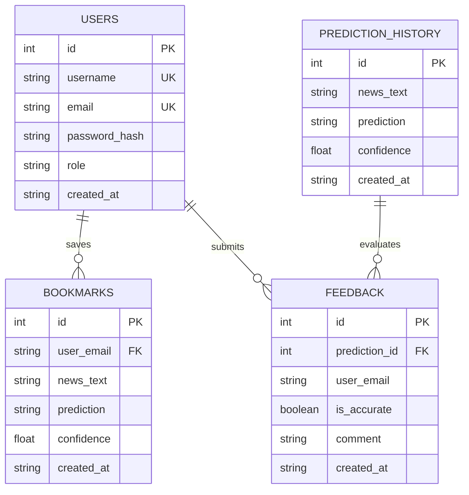

# TruthLens AI - Entity Relationship (ER) Diagram

```mermaid
erDiagram
    USERS {
        int id PK
        string username UK
        string email UK
        string password_hash
        string role
        string created_at
    }

    PREDICTION_HISTORY {
        int id PK
        string news_text
        string prediction
        float confidence
        string created_at
    }

    FEEDBACK {
        int id PK
        int prediction_id FK
        string user_email
        boolean is_accurate
        string comment
        string created_at
    }

    BOOKMARKS {
        int id PK
        string user_email FK
        string news_text
        string prediction
        float confidence
        string created_at
    }

    USERS ||--o{ BOOKMARKS : "saves"
    USERS ||--o{ FEEDBACK : "submits"
    PREDICTION_HISTORY ||--o{ FEEDBACK : "evaluates"
```
