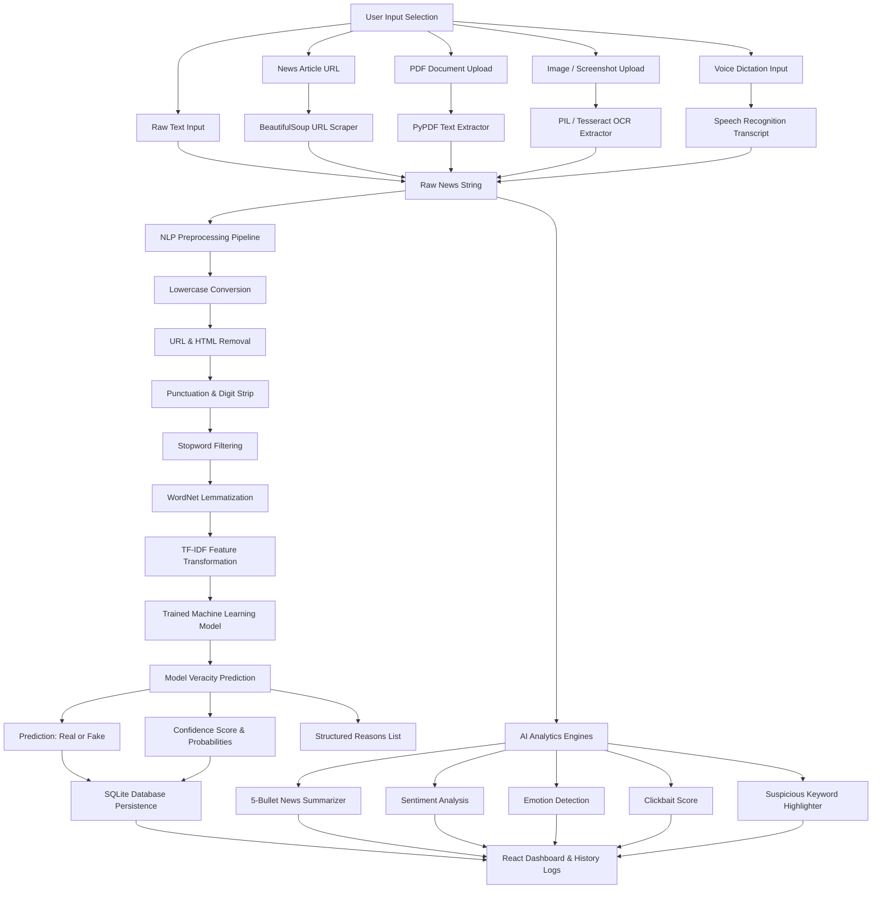

# TruthLens AI - Multi-Modal System Processing Flowchart

```mermaid
flowchart TD
    A[User Input Selection] --> B1[Raw Text Input]
    A --> B2[News Article URL]
    A --> B3[PDF Document Upload]
    A --> B4[Image / Screenshot Upload]
    A --> B5[Voice Dictation Input]

    B2 --> C1[BeautifulSoup URL Scraper]
    B3 --> C2[PyPDF Text Extractor]
    B4 --> C3[PIL / Tesseract OCR Extractor]
    B5 --> C4[Speech Recognition Transcript]

    B1 --> D[Raw News String]
    C1 --> D
    C2 --> D
    C3 --> D
    C4 --> D

    D --> E[NLP Preprocessing Pipeline]
    E --> E1[Lowercase Conversion]
    E1 --> E2[URL & HTML Removal]
    E2 --> E3[Punctuation & Digit Strip]
    E3 --> E4[Stopword Filtering]
    E4 --> E5[WordNet Lemmatization]

    E5 --> F[TF-IDF Feature Transformation]
    F --> G[Trained Machine Learning Model]

    G --> H[Model Veracity Prediction]
    H --> H1[Prediction: Real or Fake]
    H --> H2[Confidence Score & Probabilities]
    H --> H3[Structured Reasons List]

    D --> I[AI Analytics Engines]
    I --> I1[5-Bullet News Summarizer]
    I --> I2[Sentiment Analysis]
    I --> I3[Emotion Detection]
    I --> I4[Clickbait Score]
    I --> I5[Suspicious Keyword Highlighter]

    H1 --> J[SQLite Database Persistence]
    H2 --> J
    J --> K[React Dashboard & History Logs]
    I1 --> K
    I2 --> K
    I3 --> K
    I4 --> K
    I5 --> K
```
